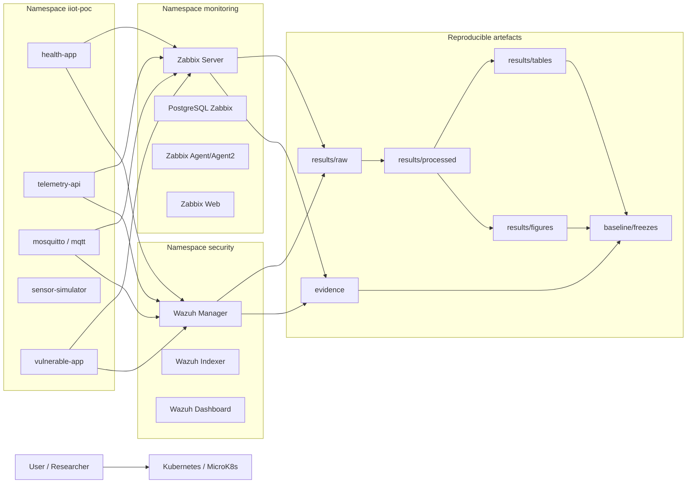

# IIoT Correlation Lab — Zabbix + Wazuh

Reproducible IIoT laboratory on Kubernetes/MicroK8s for evaluating correlated cybersecurity threat detection in Mining 4.0 using Zabbix, Wazuh, and MITRE ATT&CK for ICS techniques.

This repository is organized to support two review modes:

- **quick execution**, using scenario wrappers;
- **technical audit**, reviewing detailed scripts `00–28`, datasets, evidence, and freezes.

---

## 1. Laboratory purpose

The laboratory enables deployment and evaluation of an experimental architecture composed of:

- simulated IIoT services;
- MQTT telemetry;
- observable HTTP applications;
- operational monitoring with Zabbix;
- security detection with Wazuh;
- Zabbix–Wazuh temporal correlation;
- MITRE ATT&CK for ICS campaigns;
- legitimate operational noise for false-positive assessment;
- generation of datasets, tables, figures, evidence, and verifiable freezes.

The methodological workflow is organized into five scenarios:

| Scenario | Purpose |
|---|---|
| A — Foundation IIoT | Deployment and validation of baseline IIoT services. |
| B — Zabbix Monitoring | Operational instrumentation and Zabbix configuration export. |
| C — Wazuh Security | Security instrumentation, rules, and Wazuh events. |
| D — MITRE ICS Correlation | Quantitative campaign for T0809, T0814, and T0860. |
| E — Operational Noise/FPR | Legitimate operational noise campaign for false-positive assessment. |

---

## 2. General architecture



The architecture separates the IIoT zone, monitoring zone, and security zone using dedicated namespaces. Correlation is performed later over Wazuh events, Zabbix metrics, and normalized datasets.

---

## 3. Project structure

```text
iiot-correlation-lab/
├── config/        # Centralized experimental parameters
├── kubernetes/    # Kubernetes manifests by component
├── scripts/       # Technical scripts, wrappers, analysis, and freeze
│   ├── lib/       # Common configuration and logging functions
│   └── run/       # Technical sequence 00–28 and wrappers 29–38
├── results/       # Raw/processed datasets, tables, and figures
├── evidence/      # Exported technical evidence from Zabbix, Wazuh, and inventory
├── baseline/      # Reproducible freezes and methodology packages
├── docs/          # Detailed technical documentation
├── README.md      # Quick guide in Spanish
└── README.en.md   # Quick guide in English
```

### Quick description

| Folder | Content | Purpose |
|---|---|---|
| `config/` | Experiment variables | Avoids manually changing values across scripts. |
| `kubernetes/` | Foundation, Zabbix, and Wazuh YAML/Kustomize | Enables laboratory redeployment. |
| `scripts/run/00–28` | Detailed technical scripts | Step-by-step auditable evidence. |
| `scripts/run/29–38` | Quick wrappers | Simple execution by scenario or full campaign. |
| `results/raw/` | Raw data | Original metrics, events, and noise data. |
| `results/processed/` | Normalized/processed data | Basis for correlation and statistics. |
| `results/tables/` | Final tables | Direct inputs for manuscript results. |
| `results/figures/` | Generated figures | Graphical inputs for the manuscript. |
| `evidence/` | Technical exports | Zabbix, Wazuh, inventory, and readiness evidence. |
| `baseline/` | Freezes and SHA256 packages | Integrity and reproducibility. |
| `docs/` | Detailed documentation | Technical development, methodology, and traceability. |

---

## 4. Configuration and prerequisites

Before running campaigns, review:

```text
config/experiment.conf
```

This file centralizes and documents each variable in Spanish and English:

- functional and quantitative scenarios;
- MITRE techniques;
- repetitions;
- noise profiles;
- baseline, attack, recovery, and correlation windows;
- HTTP/MQTT load parameters;
- laboratory endpoints;
- table and result paths;
- execution and freeze controls.

Main methodological values:

```text
MITRE_TECHNIQUES="T0809 T0814 T0860"
RUNS_PER_TECHNIQUE=20
NOISE_PROFILES="LOW MEDIUM HIGH"
RUNS_PER_NOISE_PROFILE=20
BASELINE_SECONDS=120
ATTACK_ACTIVE_SECONDS=30
RECOVERY_SECONDS=120
CORRELATION_WINDOW_SECONDS=120
ZABBIX_POLLING_SECONDS=5
DOS_REQUESTS=500
DOS_CONCURRENCY=30
```

Values reported in methodology, results, and reviewer response must match this file or the metadata frozen in the final package.

---

## 5. Quick execution sequence

Scripts `33–38` group the technical sequence `00–28` to simplify scenario execution.

### Run scenario A — Foundation IIoT

```bash
./scripts/run/33-run-scenario-a-foundation.sh
```

Deploys baseline IIoT services, runs operational baseline, and freezes initial evidence.

### Run scenario B — Zabbix Monitoring

```bash
./scripts/run/34-run-scenario-b-zabbix.sh
```

Deploys Zabbix, validates functionality, configures monitoring, runs baseline, and exports configuration.

### Run scenario C — Wazuh Security

```bash
./scripts/run/35-run-scenario-c-wazuh.sh
```

Deploys Wazuh, validates components, runs security baseline, and freezes evidence.

### Run scenario D — MITRE ICS Correlation

```bash
./scripts/run/36-run-scenario-d-correlation.sh
```

Runs MITRE ICS attacks, temporal correlation, dataset export, normalization, and statistical analysis.

### Run scenario E — Operational Noise/FPR

```bash
./scripts/run/37-run-scenario-e-noise-fpr.sh
```

Runs legitimate operational noise, computes FPR, freezes results, and updates scenario E documentation.

### Run all scenarios A–E

```bash
./scripts/run/38-run-all-scenarios-ae.sh
```

Runs A, B, C, D, and E, generates the final freeze, validates readiness, and shows results.

### Run only the paper-ready final campaign D–E

```bash
./scripts/run/29-run-paper-final-campaign.sh
```

Use this when A–C are already deployed and validated. It runs only the main quantitative campaigns D and E.

---

## 6. Validation and review sequence

### Validate laboratory readiness

```bash
./scripts/run/30-validate-paper-readiness.sh
```

Validates Kubernetes node, namespaces, IIoT services, Zabbix, Wazuh, tables, figures, and final freeze if available.

### Show main results

```bash
./scripts/run/31-show-paper-results.sh
```

Shows a quick view of main tables and lists available figures without running attacks or noise.

### Verify latest freeze integrity

```bash
./scripts/run/32-verify-final-freeze.sh
```

Finds the latest `baseline/final_methodology_package_*` package and validates `SHA256SUMS`.

---

## 7. Expected results

Results are organized by processing level:

```text
results/raw/          # Raw collected data
results/processed/    # Processed and normalized datasets
results/tables/       # Consolidated tables
results/figures/      # Exported figures
```

Main tables:

| File | Description |
|---|---|
| `table_attack_detection.csv` | Detection by MITRE technique in scenario D. |
| `table_temporal_correlation_summary.csv` | Zabbix–Wazuh temporal correlation summary. |
| `table_mttd_estimation.csv` | Detection delta/operationalized MTTD estimation. |
| `table_bootstrap_ci.csv` | Bootstrap confidence intervals. |
| `table_detection_wilson_ci.csv` | Wilson intervals for detection. |
| `table_sla_wilson_ci.csv` | Wilson intervals for availability/SLA. |
| `table_noise_fpr_summary.csv` | Observed FPR under legitimate operational noise. |
| `table_noise_wilson_ci.csv` | Wilson 95% CI for FPR. |
| `table_scenario_readiness.csv` | A–E methodological readiness status. |
| `table_zabbix_history_quality.csv` | Zabbix historical sample quality. |

Main figures:

| File | Description |
|---|---|
| `figure_attack_timeline.svg` | Attack–event–correlation timeline. |
| `figure_operational_vs_security.svg` | Operational and security comparison. |
| `figure_detection_comparison.svg` | Detection comparison by technique/scenario. |
| `figure_temporal_correlation_distribution.svg` | Temporal delta distribution. |
| `figure_noise_fpr_by_profile.svg` | FPR by operational noise profile. |
| `figure_zabbix_history_quality.svg` | Zabbix historical extraction quality. |

---

## 8. Evidence and freezes

Technical evidence is stored in:

```text
evidence/zabbix/       # Zabbix hosts, items, triggers, and exports
evidence/wazuh/        # Wazuh alerts, events, rules, logs, and exports
evidence/inventory/    # Kubernetes inventory, images, services, and versions
evidence/readiness/    # A–E validations and methodological readiness
```

Frozen packages are stored in:

```text
baseline/
```

Final packages follow this pattern:

```text
baseline/final_methodology_package_YYYYMMDDTHHMMSSZ/
baseline/final_methodology_package_YYYYMMDDTHHMMSSZ.tar.gz
```

Each final package includes `SHA256SUMS`. To verify integrity:

```bash
./scripts/run/32-verify-final-freeze.sh
```

---

## 9. Detailed documentation

| Topic | Document |
|---|---|
| Overview | `docs/00-overview.md` |
| Architecture | `docs/01-architecture.md` |
| Environment/versions | `docs/02-environment.md`, `docs/12-version-matrix.md` |
| Foundation IIoT | `docs/03-foundation-iiot.md` |
| Operational baseline | `docs/04-operational-baseline.md` |
| Zabbix | `docs/05-zabbix-monitoring.md` |
| Wazuh | `docs/06-wazuh-security.md` |
| Correlation | `docs/07-correlation.md` |
| Experiments | `docs/08-experiments.md` |
| Results | `docs/09-results.md`, `docs/14-paper-results-synthesis.md` |
| Reproducibility | `docs/10-reproducibility.md`, `docs/20-paper-final-reproducibility.md` |
| Experimental design | `docs/11-experimental-design.md` |
| Reviewer traceability | `docs/13-reviewer-traceability.md` |
| A–E roles and evidence | `docs/16-scenario-roles-and-evidence.md` |
| Configuration and execution | `docs/17-configuration-and-execution.md` |
| Non-programmer workflow | `docs/18-non-programmer-workflow.md` |
| Message standard | `docs/19-script-message-standard.md` |
| Scenario wrappers | `docs/21-scenario-wrapper-execution.md` |

---

## 10. Methodological note

Scripts `00–28` remain the auditable technical engine. Scripts `29–38` provide a quick execution layer to facilitate third-party reproducibility.

The methodological separation is:

```text
A–C = functional validation and instrumentation
D–E = main quantitative campaigns
```

This avoids interpreting deployment tasks as final statistical results and allows the experimental evidence to be documented clearly.
