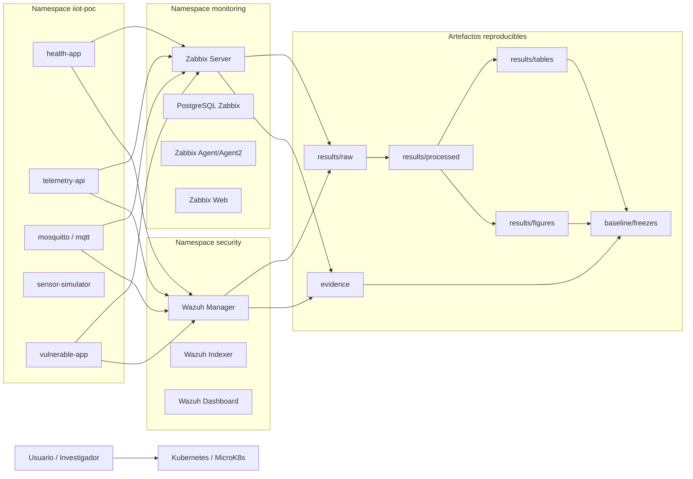

# IIoT Correlation Lab — Zabbix + Wazuh

Laboratorio IIoT reproducible sobre Kubernetes/MicroK8s para evaluar detección correlacionada de amenazas de ciberseguridad en Minería 4.0 mediante Zabbix, Wazuh y técnicas MITRE ATT&CK for ICS.

Este repositorio está organizado para que el laboratorio pueda ser revisado de dos formas:

- **ejecución rápida**, usando wrappers por escenario;
- **auditoría técnica**, revisando los scripts detallados `00–28`, datasets, evidencias y freezes.

---

## 1. Propósito del laboratorio

El laboratorio permite desplegar y evaluar una arquitectura experimental compuesta por:

- servicios IIoT simulados;
- telemetría MQTT;
- aplicaciones HTTP observables;
- monitoreo operacional con Zabbix;
- detección de seguridad con Wazuh;
- correlación temporal Zabbix–Wazuh;
- campañas MITRE ATT&CK for ICS;
- ruido operacional legítimo para evaluación de falsos positivos;
- generación de datasets, tablas, figuras, evidencias y freezes verificables.

La lógica metodológica se organiza en cinco escenarios:

| Escenario | Propósito |
|---|---|
| A — Foundation IIoT | Despliegue y validación de servicios IIoT base. |
| B — Zabbix Monitoring | Instrumentación operacional y exportación de configuración Zabbix. |
| C — Wazuh Security | Instrumentación de seguridad, reglas y eventos Wazuh. |
| D — MITRE ICS Correlation | Campaña cuantitativa de ataques T0809, T0814 y T0860. |
| E — Operational Noise/FPR | Campaña de ruido operacional legítimo para evaluar falsos positivos. |

---

## 2. Arquitectura general



La arquitectura separa la zona IIoT, la zona de monitoreo y la zona de seguridad mediante namespaces dedicados. La correlación se realiza posteriormente sobre eventos Wazuh, métricas Zabbix y datasets normalizados.

---

## 3. Estructura del proyecto

```text
iiot-correlation-lab/
├── config/        # Parámetros experimentales centralizados
├── kubernetes/    # Manifiestos Kubernetes por componente
├── scripts/       # Scripts técnicos, wrappers, análisis y freeze
│   ├── lib/       # Funciones comunes de configuración y logging
│   └── run/       # Secuencia técnica 00–28 y wrappers 29–38
├── results/       # Datasets raw/processed, tablas y figuras
├── evidence/      # Evidencias técnicas exportadas de Zabbix, Wazuh e inventario
├── baseline/      # Freezes reproducibles y paquetes metodológicos
├── docs/          # Documentación técnica detallada
├── README.md      # Guía rápida en español
└── README.en.md   # Guía rápida en inglés
```

### Descripción rápida

| Carpeta | Qué contiene | Para qué sirve |
|---|---|---|
| `config/` | Variables del experimento | Evita cambiar valores manualmente en varios scripts. |
| `kubernetes/` | YAML/Kustomize de foundation, Zabbix y Wazuh | Permite redesplegar el laboratorio. |
| `scripts/run/00–28` | Scripts técnicos detallados | Evidencia auditable paso a paso. |
| `scripts/run/29–38` | Wrappers rápidos | Ejecución simple por escenario o campaña completa. |
| `results/raw/` | Datos crudos | Fuente original de métricas, eventos y ruido. |
| `results/processed/` | Datos normalizados/procesados | Base para correlación y estadística. |
| `results/tables/` | Tablas finales | Insumos directos para resultados del artículo. |
| `results/figures/` | Figuras generadas | Insumos gráficos del artículo. |
| `evidence/` | Exportaciones técnicas | Sustento de Zabbix, Wazuh, inventario y readiness. |
| `baseline/` | Freezes y paquetes SHA256 | Integridad y reproducibilidad. |
| `docs/` | Documentación detallada | Desarrollo técnico, metodología y trazabilidad. |

---

## 4. Configuración y prerequisitos

Antes de ejecutar campañas, revisar el archivo:

```text
config/experiment.conf
```

Este archivo centraliza y documenta variable por variable, en español e inglés:

- escenarios funcionales y cuantitativos;
- técnicas MITRE;
- número de repeticiones;
- perfiles de ruido;
- ventanas basal, ataque, recuperación y correlación;
- parámetros de carga HTTP/MQTT;
- endpoints del laboratorio;
- rutas de tablas y resultados;
- controles de ejecución y freeze.

Valores metodológicos principales:

```text
MITRE_TECHNIQUES="T0809 T0814 T0860"
RUNS_PER_TECHNIQUE=20
NOISE_PROFILES="LOW MEDIUM HIGH"
RUNS_PER_NOISE_PROFILE=20
BASELINE_SECONDS=120
ATTACK_ACTIVE_SECONDS=30
RECOVERY_SECONDS=120
CORRELATION_WINDOW_SECONDS=120
ZABBIX_POLLING_SECONDS=5
DOS_REQUESTS=500
DOS_CONCURRENCY=30
```

Los valores reportados en metodología, resultados y respuesta a revisores deben coincidir con este archivo o con la metadata congelada en el freeze final.

---

## 5. Secuencia de ejecución rápida

Los scripts `33–38` agrupan la secuencia técnica `00–28` para facilitar la ejecución por escenario.

### Ejecutar escenario A — Foundation IIoT

```bash
./scripts/run/33-run-scenario-a-foundation.sh
```

Despliega servicios IIoT base, ejecuta baseline operacional y congela evidencia inicial.

### Ejecutar escenario B — Zabbix Monitoring

```bash
./scripts/run/34-run-scenario-b-zabbix.sh
```

Despliega Zabbix, valida funcionamiento, configura monitoreo, ejecuta baseline y exporta configuración.

### Ejecutar escenario C — Wazuh Security

```bash
./scripts/run/35-run-scenario-c-wazuh.sh
```

Despliega Wazuh, valida componentes, ejecuta baseline de seguridad y congela evidencia.

### Ejecutar escenario D — MITRE ICS Correlation

```bash
./scripts/run/36-run-scenario-d-correlation.sh
```

Ejecuta ataques MITRE ICS, correlación temporal, exportación de datasets, normalización y análisis estadístico.

### Ejecutar escenario E — Operational Noise/FPR

```bash
./scripts/run/37-run-scenario-e-noise-fpr.sh
```

Ejecuta ruido operacional legítimo, calcula FPR, congela resultados y actualiza documentación del escenario E.

### Ejecutar todos los escenarios A–E

```bash
./scripts/run/38-run-all-scenarios-ae.sh
```

Ejecuta A, B, C, D y E, genera freeze final, valida readiness y muestra resultados.

### Ejecutar solo campaña final paper-ready D–E

```bash
./scripts/run/29-run-paper-final-campaign.sh
```

Usar cuando A–C ya están desplegados y validados. Ejecuta solo las campañas cuantitativas principales D y E.

---

## 6. Secuencia de validación y revisión

### Validar readiness del laboratorio

```bash
./scripts/run/30-validate-paper-readiness.sh
```

Valida nodo Kubernetes, namespaces, servicios IIoT, Zabbix, Wazuh, tablas, figuras y freeze final si existe.

### Mostrar resultados principales

```bash
./scripts/run/31-show-paper-results.sh
```

Muestra una vista rápida de las tablas principales y lista figuras disponibles sin ejecutar ataques ni ruido.

### Verificar integridad del último freeze

```bash
./scripts/run/32-verify-final-freeze.sh
```

Busca el último paquete `baseline/final_methodology_package_*` y valida `SHA256SUMS`.

---

## 7. Resultados esperados

Los resultados se organizan por nivel de procesamiento:

```text
results/raw/          # Datos crudos recolectados
results/processed/    # Datasets procesados y normalizados
results/tables/       # Tablas consolidadas
results/figures/      # Figuras exportadas
```

Tablas principales:

| Archivo | Descripción |
|---|---|
| `table_attack_detection.csv` | Detección por técnica MITRE en escenario D. |
| `table_temporal_correlation_summary.csv` | Resumen de correlación temporal Zabbix–Wazuh. |
| `table_mttd_estimation.csv` | Estimación de delta de detección/MTTD operacionalizado. |
| `table_bootstrap_ci.csv` | Intervalos de confianza por bootstrap. |
| `table_detection_wilson_ci.csv` | Intervalos Wilson para detección. |
| `table_sla_wilson_ci.csv` | Intervalos Wilson para disponibilidad/SLA. |
| `table_noise_fpr_summary.csv` | FPR observado bajo ruido operacional legítimo. |
| `table_noise_wilson_ci.csv` | Intervalo Wilson IC95 para FPR. |
| `table_scenario_readiness.csv` | Estado de preparación metodológica A–E. |
| `table_zabbix_history_quality.csv` | Calidad de muestras históricas Zabbix. |

Figuras principales:

| Archivo | Descripción |
|---|---|
| `figure_attack_timeline.svg` | Línea temporal ataque–evento–correlación. |
| `figure_operational_vs_security.svg` | Comparación operacional y seguridad. |
| `figure_detection_comparison.svg` | Comparación de detección por técnica/escenario. |
| `figure_temporal_correlation_distribution.svg` | Distribución de deltas temporales. |
| `figure_noise_fpr_by_profile.svg` | FPR por perfil de ruido operacional. |
| `figure_zabbix_history_quality.svg` | Calidad de extracción histórica Zabbix. |

---

## 8. Evidencias y freezes

Las evidencias técnicas se almacenan en:

```text
evidence/zabbix/       # Hosts, items, triggers y exportaciones Zabbix
evidence/wazuh/        # Alertas, eventos, reglas, logs y exports Wazuh
evidence/inventory/    # Inventario Kubernetes, imágenes, servicios y versiones
evidence/readiness/    # Validaciones A–E y readiness metodológico
```

Los paquetes congelados se almacenan en:

```text
baseline/
```

El paquete final sigue el patrón:

```text
baseline/final_methodology_package_YYYYMMDDTHHMMSSZ/
baseline/final_methodology_package_YYYYMMDDTHHMMSSZ.tar.gz
```

Cada paquete final incluye `SHA256SUMS`. Para verificar integridad:

```bash
./scripts/run/32-verify-final-freeze.sh
```

---

## 9. Documentación detallada

| Tema | Documento |
|---|---|
| Visión general | `docs/00-overview.md` |
| Arquitectura | `docs/01-architecture.md` |
| Entorno/versiones | `docs/02-environment.md`, `docs/12-version-matrix.md` |
| Foundation IIoT | `docs/03-foundation-iiot.md` |
| Baseline operacional | `docs/04-operational-baseline.md` |
| Zabbix | `docs/05-zabbix-monitoring.md` |
| Wazuh | `docs/06-wazuh-security.md` |
| Correlación | `docs/07-correlation.md` |
| Experimentos | `docs/08-experiments.md` |
| Resultados | `docs/09-results.md`, `docs/14-paper-results-synthesis.md` |
| Reproducibilidad | `docs/10-reproducibility.md`, `docs/20-paper-final-reproducibility.md` |
| Diseño experimental | `docs/11-experimental-design.md` |
| Trazabilidad reviewer | `docs/13-reviewer-traceability.md` |
| Roles A–E y evidencia | `docs/16-scenario-roles-and-evidence.md` |
| Configuración y ejecución | `docs/17-configuration-and-execution.md` |
| Flujo no programador | `docs/18-non-programmer-workflow.md` |
| Estándar de mensajes | `docs/19-script-message-standard.md` |
| Wrappers por escenario | `docs/21-scenario-wrapper-execution.md` |

---

## 10. Nota metodológica

Los scripts `00–28` siguen siendo el motor técnico auditable del laboratorio. Los scripts `29–38` son una capa de ejecución rápida para facilitar reproducibilidad por terceros.

La separación metodológica es:

```text
A–C = validación funcional e instrumentación
D–E = campañas cuantitativas principales
```

Esto evita interpretar tareas de despliegue como resultados estadísticos finales y permite documentar de forma clara la evidencia experimental.
